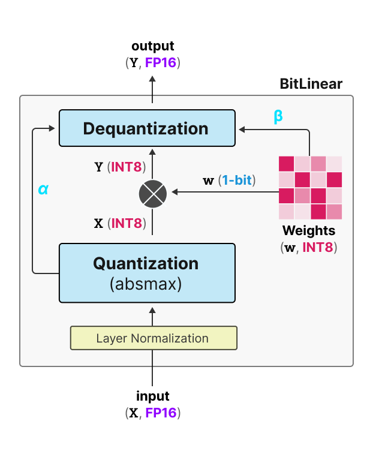
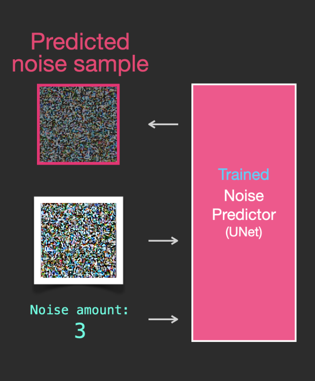
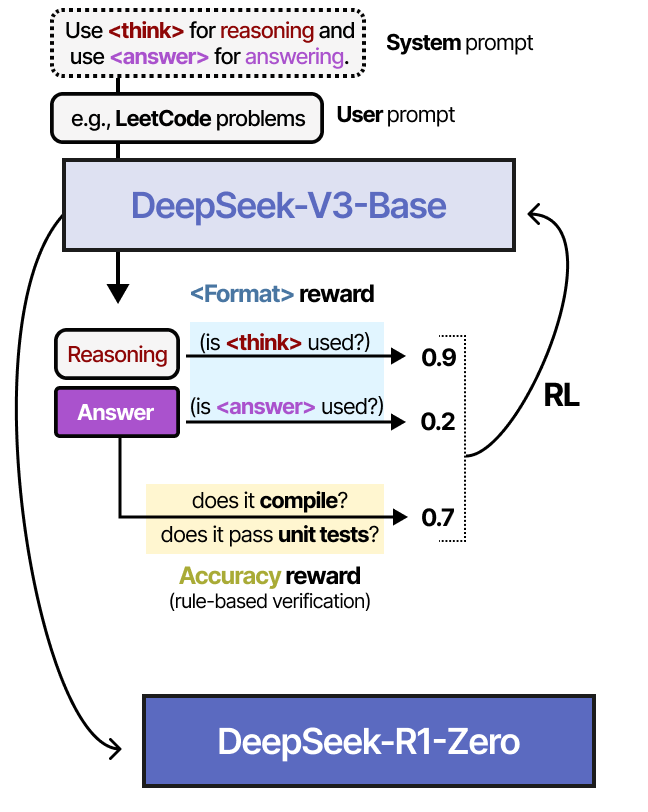
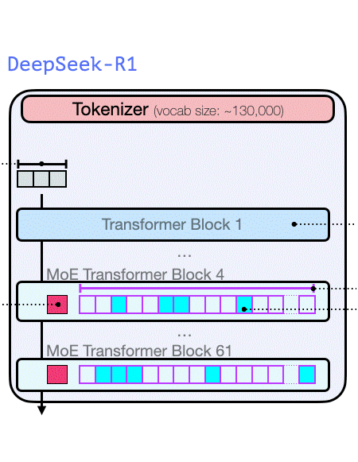

| [A Visual Guide to Mamba](https://newsletter.maartengrootendorst.com/p/a-visual-guide-to-mamba-and-state)             |  [A Visual Guide to Quantization](https://newsletter.maartengrootendorst.com/p/a-visual-guide-to-quantization) | [The Illustrated Stable Diffusion](https://jalammar.github.io/illustrated-stable-diffusion/) |
:-------------------------:|:-------------------------:|:-------------------------:
  |   |  
**[A Visual Guide to Mixture of Experts](https://newsletter.maartengrootendorst.com/p/a-visual-guide-to-mixture-of-experts)**  | **[A Visual Guide to Reasoning LLMs](https://newsletter.maartengrootendorst.com/p/a-visual-guide-to-reasoning-llms)**  |  **[The Illustrated DeepSeek-R1](https://newsletter.languagemodels.co/p/the-illustrated-deepseek-r1)**
  |   |  
